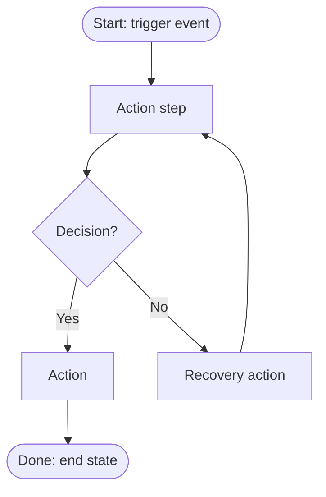

# Flowcharts & Output Formats

## When to include a flowchart

- **Yes:** the process has decision points, conditional branches, escalation paths, or handoffs between roles.
- **No:** purely linear steps — a flowchart of 8 boxes in a straight line adds nothing. Say "linear process — no flowchart needed" and move on.
- The flowchart shows the **shape** of the process (decisions and branches); the numbered procedure holds the detail. Don't duplicate every sub-step into the chart — 15–25 nodes is the ceiling before it stops being readable.

## Mermaid conventions



Rules that keep charts rendering reliably:

- `flowchart TD` (top-down) by default; `LR` only when the chart is shallow and wide.
- Node text: short verb phrases, no parentheses/quotes/`&` inside `[...]` labels — they break the parser. Use `<br/>` for line breaks.
- Decisions are always `{questions ending in ?}` with labeled edges (`-- Yes -->`).
- Rounded `([ ])` for start/end, `[ ]` for actions, `{ }` for decisions, `[[ ]]` for references to other SOPs.
- One start node. Every branch reaches an end node or loops back explicitly — no dangling paths.
- Swimlane-ish handoffs: prefix the node label with the role — `B[VA: draft reply]`.

## Rendering the chart to an image (for PDF / Word)

In the sandbox:

```bash
npx -y @mermaid-js/mermaid-cli -i chart.mmd -o chart.png -w 1600 -b white
```

- Put only the Mermaid code (no ```` ```mermaid ```` fences) in `chart.mmd`.
- If `npx` or Chromium fails in the sandbox, **fall back** rather than stall:
  1. HTML output → embed Mermaid source with the CDN script (below), which renders in the browser anyway.
  2. PDF/Word → replace the chart with the §8-style decision table plus the plain-text process overview, and flag it: "flowchart omitted — rendering unavailable, decision table included instead."

## Output formats

Markdown master is always written first and always saved. Then:

### HTML (self-contained, single file)

Build by hand (no build step): inline CSS, no external assets except the Mermaid CDN script. Structure:

- Clean document styling: max-width ~800px, system font stack, generous line height; document-control block styled as a bordered table; warnings as tinted callout boxes.
- Mermaid via CDN:

```html
<script type="module">
  import mermaid from "https://cdn.jsdelivr.net/npm/mermaid@11/dist/mermaid.esm.min.mjs";
  mermaid.initialize({ startOnLoad: true, theme: "neutral" });
</script>
<pre class="mermaid">
flowchart TD
    ...
</pre>
```

- Add `@media print` styles (hide nothing, avoid page-break inside steps) so the HTML doubles as a print-to-PDF fallback.
- If this SOP represents Joel's business (his service, his template), check the **joel-brand** skill for theming. Client deliverables get the client's look or a neutral professional style — never Joel's brand.

### PDF

Read the **pdf** skill's SKILL.md and follow it. Flowchart goes in as the rendered PNG. Keep the document-control table on page 1.

### Word (.docx)

Read the **docx** skill's SKILL.md and follow it. Use real heading styles (Heading 1/2) so the client gets a navigable document; flowchart as embedded PNG; revision history as a table at the end.

### Format choice guide

| Audience / use | Best format |
|---|---|
| Client will edit or maintain it themselves | Word |
| Client wants a polished, fixed deliverable | PDF |
| Team reference, shared link, living doc | HTML (+ Markdown master) |
| Feeding another agent/skill later | Markdown only |
